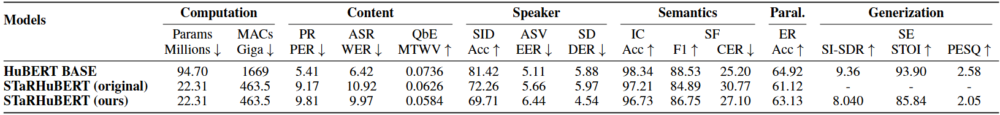

# STaRHuBERT Reimplementation

This repository contains a reimplementation of [STaRHuBERT](https://arxiv.org/pdf/2312.09040v1).

*This project was developed as part of the CMU-11785 course.*

Contributors: Qingzheng Wang, Shun Li, Toris Ye, Fanxing Bu

<p align="center">

</p>

- **<u>S</u>peech <u>T</u>empor<u>a</u>l <u>R</u>elation (STaR)**: Distill the knowledge by focusing on the pairwise **temporal relation** between two speech frames.
- **Temporal Gram Matrix (TGM)**: Propose Temporal Gram Matrix which aggregates channel information at two time steps.
  - Layer-wise TGM: Distill the TGM for every Transformer layer
  - Intra-layer TGM: Modify the TGM as computing the temporal relation between the input and output of a single Transformer layer.

**Reimplementation Results:**

<p align="center">

</p>

## Checkpoints

Below is the checkpoint for our reimplementation:

- STaRHuBERT (22.3M): [ckpt](https://drive.google.com/file/d/1vCPosrb11LjNVJVV9IvO4o5vyze6MsMQ/view?usp=sharing), [yaml](https://drive.google.com/file/d/1xilGjTNNouzqgRzqBSBF6LNo60vclXwW/view?usp=sharing)

## Distillation

The STaR distillation code is implemented in [train_starhubert.py](https://github.com/Qingzheng-Wang/STaRHuBERT/blob/master/train_starhubert.py), which we developed as it was not included in the original repository provided by the paper.

## Fine-tuning on Downstream Tasks

You can evaluate our reimplementation on SUPERB downstream tasks using our checkpoint by following the steps below.

1. Clone and install the [S3PRL toolkit](https://github.com/s3prl/s3prl) with ```pip install -e ".[all]"``` (dev mode).

2. Copy the entire `./models/starhubert` folder into `<s3prl root>/s3prl/upstream/`.

3. Please add upstream importing line in `<s3prl root>/s3prl/hub.py`.	
	```
	from s3prl.upstream.starhubert.hubconf import *
	```

4. Please change each config file of s3prl downstream tasks as follows.
	+ Uncomment learning rate scheduler
	+ Learning rate scaled to 10x in spekaer identification (SID) task

5. Run the following command to fine-tune the ARMHuBERT model.

	For automatic speech recognition (ASR) as an example:
	```
	python run_downstream.py \
	-m train \
	-n STaRHuBERT \  # You can set your exp name whatever you want
	-u starhubert \
	-d asr \
	-k <path to .ckpt file in <git root>/results/pretrain/> \
	-g <path to .yaml file in <git root>/results/pretrain/>
	```
	Note: Refer to the [SUPERB docs](https://github.com/s3prl/s3prl/blob/master/s3prl/downstream/docs/superb.md) for more information on usage details and data preparation.
